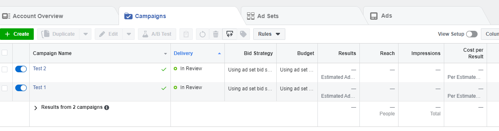
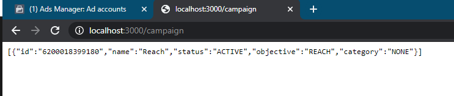
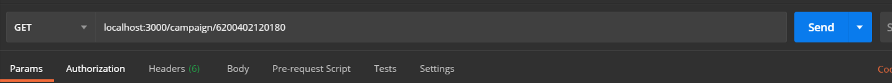
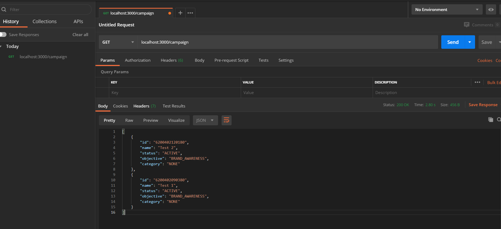
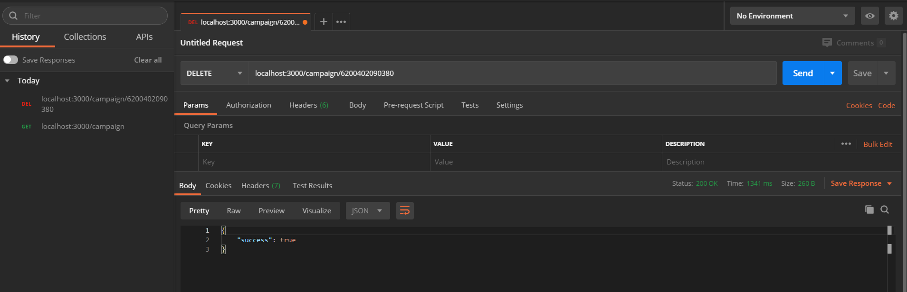

# Facebook Ad Campaign

An Facebook Ad Campaign where we need to create campaingn and apply CRUD with expressJS. Our goal is to create, read, update and delete ad campaign in Facebook ad manager.

1. Created Two Campaigns 

2. Running Campaign Locally 

3. Fetching Campaigns 

4. Getting Campaigns with ID

5. Deleting an Campaigns 

Before you could proceed you need to go through the below requirements.

# Features

-   Inline Code API
-   Using of Postman for fetting the Calls for CRUD 

# Installation

## Before you install

1. Make sure nodejs and npm is installed if not run the following command (npm install npm -g) for windows 
2. For Windows OS follow the nodejs installer
3. Make Sure you have Postman App or USe CURL whichever you feel comfortable.

## To get a local copy up and running follow these simple steps.

git clone https://github.com/shubham14p3/fb-crud-ad-campaign-node-express.git

## Install Packages

Run the following code : npm install

## Built With

- NodeJS,
- Express,
- POSTMAN
- FB SDK
- NPM

## Running Test Cases

1. nmp start
2. Go to browser or Postman : localhost:3000 to check the npm is working or not
3. localhost:3000/campaign to get campaign
4. localhost:3000/campaign/ID to get details
5. Use Postman or Curl to use CRUD 

### Prerequisites

1. Remeber to get the [Access Token](https://developers.facebook.com/tools/explorer/)
2. Remeber to Get the [Ad Account ID](https://developers.facebook.com/apps/)
3. Place it into the Json fine

## Authors

👤 **Shubham Raj**

- Github: [@Shubham Raj](https://github.com/shubham14p3)
- Linkedin: [Shubham Raj](https://linkedin.com/in/shubham14p3)

## 🤝 Contributing

Contributions, issues and feature requests are welcome!

Feel free to check the [issues page](issues/).

## Show your support

Give a ⭐️ if you like this project!

## Acknowledgments

- https://developers.facebook.com/docs/graph-api/reference/user/
- https://developers.facebook.com/docs/graph-api/using-graph-api/error-handling/
- https://developers.facebook.com/docs/marketing-api/error-reference

## 📝 License

This project is [MIT](lic.url) licensed.
